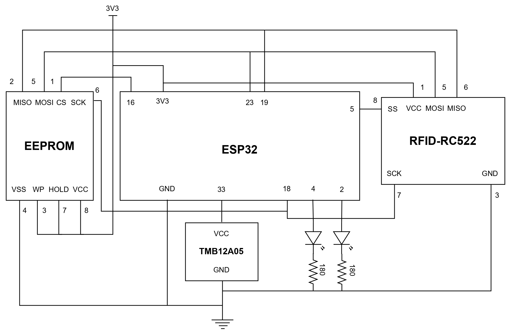
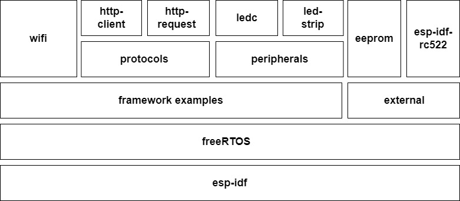
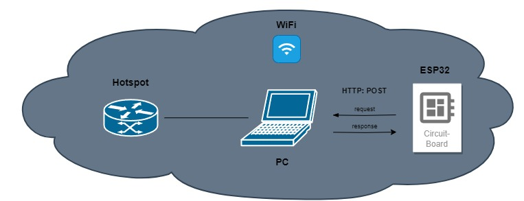
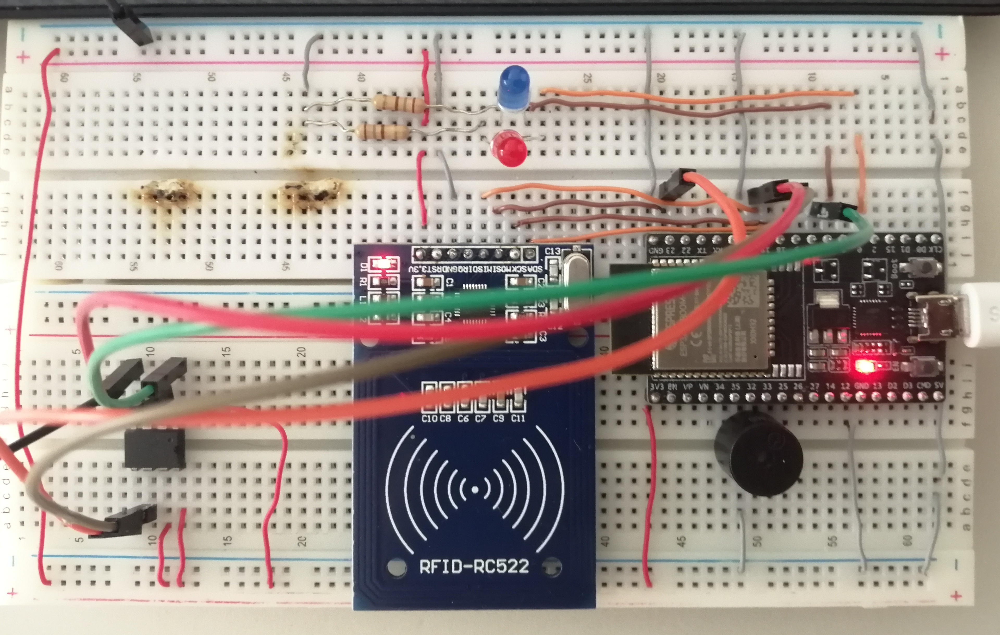

# ase-project

Project for the subject Arquitetura para Sistemas Embutidos (Embedded Systems Architecture).

RFID card reader using a RC522 and an ESP32 microcontroller.  
The card accesses are displayed on a dashboard and the data is stored on a text file.  
The access feedback is given by a buzzer and LEDs.  
Serving as a black box, there is a EEPROM that stores the card Serial Number of the last access.

## Requirements

### Hardware
- ESP32 microcontroller
- RFID-RC522 reader
- 2 LEDs
- 1 Buzzer TMB12A05
- 1 EEPROM 25LC040A

### Software
- Expressif IDF framework
- Espressif IDF VSCode extension (optional)
- ESP-IDF Power Shell (optional)

## Setup

Begin by cloning this repository and its submodules:

```bash
git clone --recursive git@github.com:digas99/ase-project.git
```

### Connection

The ESP32 and the dashboard must be connected to the same network. It can be done, for example, in a LAN network, by connecting both to the same hotspot.  
To check the IP of the computer, run the command ```ipconfig``` on Windows or ```ifconfig``` on Linux.
On file ```esp32/main/rfid.c```, change the following lines:
```c
#define WIFI_SSID "SSID"            // SSID of the network
#define WIFI_PASS "PASSWORD"        // Password of the network
#define SERVER_IP "192.168.X.X"     // IP of the computer running the dashboard
```
On file ```dashboard/main.py```, change the following lines:
```python
SERVER_IP = "192.168.X.X"           # IP of the computer running the dashboard
```

### ESP32

First, make sure the values for the pins are correct in the beginning of the file ```esp32/main/rfid.c```.  

The setup of the esp module can be done using the Espressif IDF VSCode extension by clicking on ESP-IDF Build, Flash and Monitor buttons.

To setup using the terminal, either using ESP-IDF Power Shell or a terminal with the ESP-IDF environment variables set, run the following commands:

```bash
cd esp32
idf.py build                # Build the project
idf.py -p <port> flash      # Flash the project to the microcontroller
idf.py -p <port> monitor    # Monitor the serial output
```

On Windows, the port can be found on Device Manager, under Ports (COM & LPT).  
To exit the monitor, press ```Ctrl + ]``` or ```Ctrl + T Ctrl + X```.

### Dashboard

To setup the dashboard (might want to use a virtual environment), run the following commands:

```bash
cd dashboard
pip3 install -r requirements.txt
python3 main.py
```

## Components

- [esp-idf-rc522](https://github.com/abobija/esp-idf-rc522) (external library) - RC522 driver
- [esp-http](esp32/components/esp-http/) (implemented by us) - HTTP client
- [esp-eeprom](esp32/components/esp-eeprom/) (implemented by us) - EEPROM driver


## Architecture

### Hardware


### Software


### Communication


### Circuit
